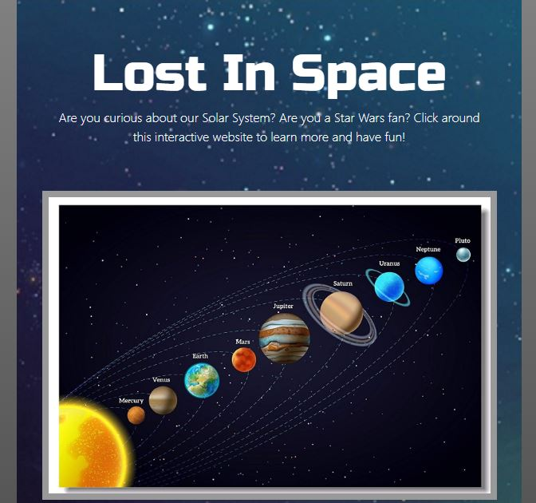
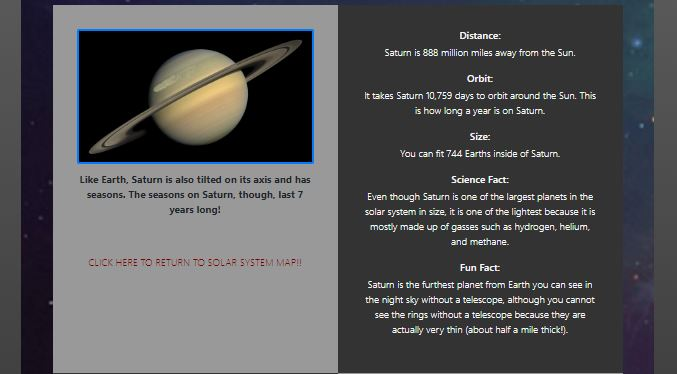
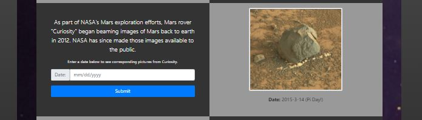
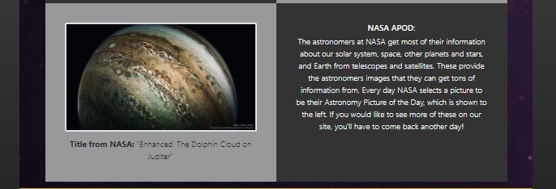
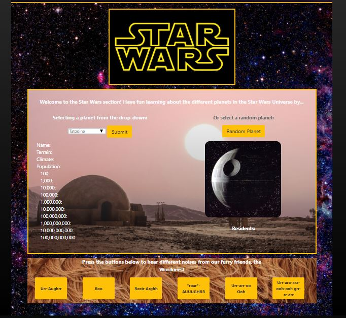

# Lost in Space

This large brochure-style site has many features to educate and entertain a target audience of school-aged children about the Solar System and Star Wars. This was my first group collaboration project assignment in my coding bootcamp.

[Visit Site!](https://amfirebaugh.github.io/fireballsproject1/)

## Features

### Clickable image map of the solar system: 

Users can click on the sun and planets within the solar system image to interact with the page. Information, pictures, and fun facts appear below, and the page automatically scrolls to this section. (On page load there is a default image and guided tips in these sections.) A link appears to return to the image map for user-friendliness. Currently no working API exists with information of this nature, and so we built arrays containing this information to call upon.

### Mars Rover "Curiosity":

This smaller section uses the NASA Mars Rover API to call for photos from the Mars rover named Curiosity. On page load the default image was chosen because of it's Pi Day date. Users can enter any date within the range that this rover has been on Mars and a photo taken on Mars on that date will be displayed. If the user attempts to enter a date not within the range, popovers guide the user to the correct interval.

### NASA APOD:

This is another smaller section that uses another NASA API. This one is called APOD, or Astronomy Picture of the Day. This section automatically displays this chosen picture of the day, its title, and some text explaining this to the target audience.

### Star Wars:

Users select a planet (from the Star Wars universe of course!) using the dropdown menu or clicking the random planet button and then a variety of information and an image of this planet are displayed for the user. Directly below this is a small section of buttons that will play Wookie noises if clicked. All of this is made possible using the SWAPI, or Star Wars, API.

## Technologies

HTML, CSS, Bootstrap, jQuery, API's

The rwdImageMaps jQuery plugin was critical for the use of our image map. Without this plugin, the image map is not responsive, and essentially does not work since screen sizes vary so much.

## Future Development

I would like to add a nav bar and links throughout the page for easier navigation as well as scroll easy functionalities. This site could also benefit from more media queries for different screen sizes to improve the design in its responsiveness. As a group we thought about incorporating the use of light boxes for image displays, as well as enhancing the coordination between the planet dropdown and random planet button in the Star Wars section. Personally, I would also like to continue working on some of the design features of this site and cleaning up some of the code.

## Contributors

This is a forked project I wish to work on myself. Of course, though, this original project would definitely not be possible without my fellow group members: Darren Smith, Erik Ferri, and Scott Bratcher.
